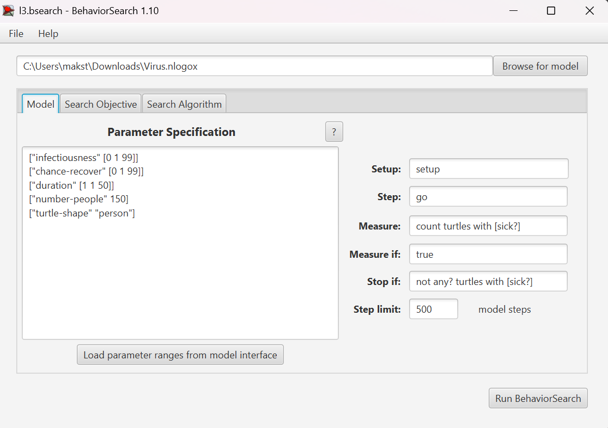
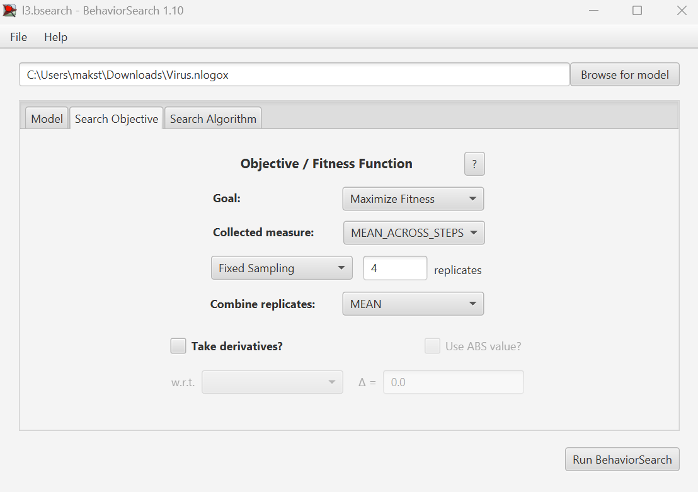
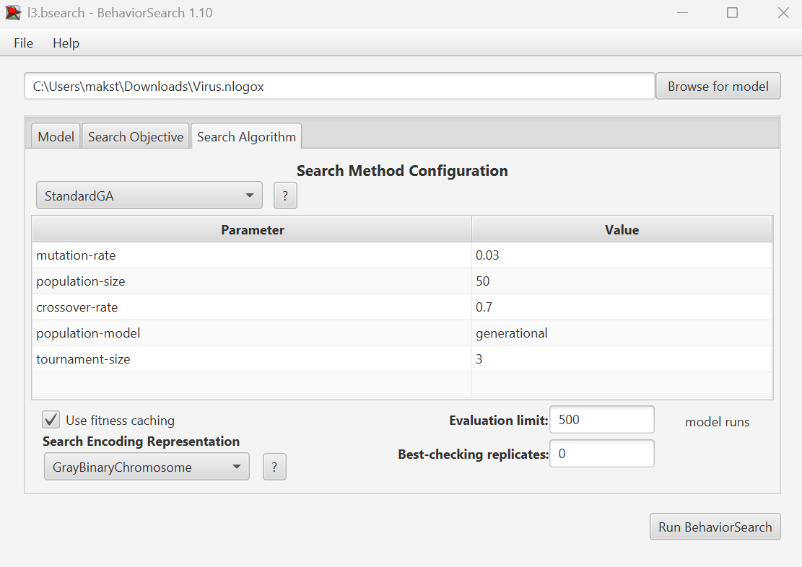
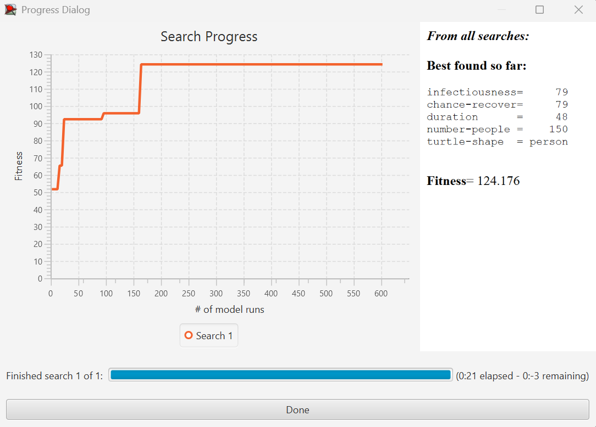
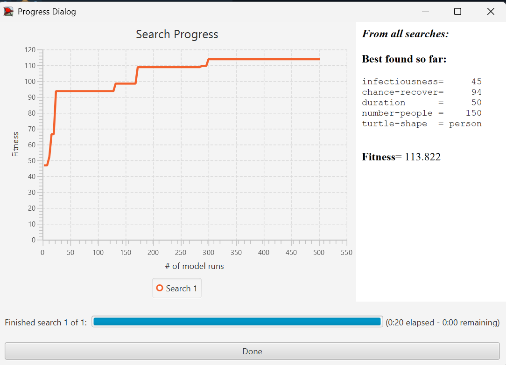
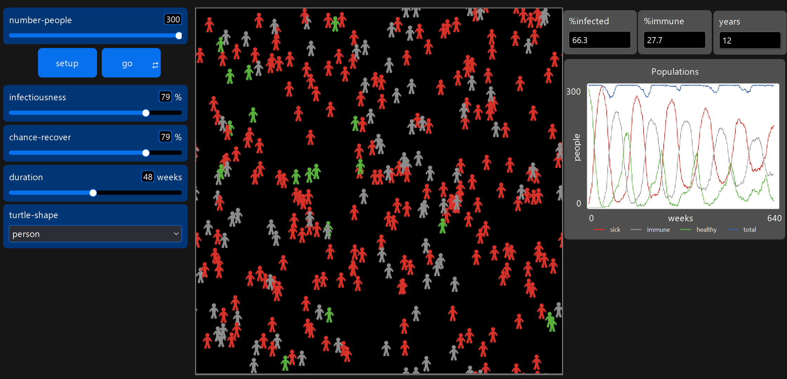

## Комп'ютерні системи імітаційного моделювання
## СПм-24-2, Трегубенко Максим Андрійович
### Лабораторна робота №**3**. Використання засобів обчислювального інтелекту для оптимізації імітаційних моделей

 

### Варіант 3, модель у середовищі NetLogo:
[Virus](https://www.netlogoweb.org/launch#https://www.netlogoweb.org/assets/modelslib/Sample%20Models/Biology/Virus.nlogo)

 

### Налаштування середовища BehaviorSearch:

**Параметри моделі** (вкладка Model):  
<pre>
["duration" [0 1 99]]
["chance-recover" [0 1 99]]
["infectiousness" [0 1 99]]
["number-people" 150]
["turtle-shape" "person"]
</pre>

Для фітнес-функції було обрано **кількість хворих людуй**, вираз для її розрахунку взято з налаштувань графіка **Populations** аналізованої імітаційної моделі в середовищі NetLogo:

та вказано у параметрі "**Measure**":
<pre>
count turtles with [ immune? ]
</pre>

Кількість людей у популяції з імунітетом має розраховуватись **в середньому** за весь період симуляції тривалістю 500 тактів, адже на кожному такті є своє значення кількості, починаючи з 0 такту симуляції.
Параметр "**Mesure if**" встановлено зі значенням true. Параметр зупинки за умовою ("**Stop if**") визначено як **not any? turtles with [sick?]** (популяція одужала). 
Загальний вигляд вкладки налаштувань параметрів моделі:  

**Налаштування цільової функції** (вкладка Search Objective):  
Для оптимізації параметрів моделі було обрано завдання максимізації показника колективного імунітету. У вкладці **Search Objective** параметр **Goal** налаштовано на значення **Maximize Fitness**, що спонукає алгоритм шукати такі комбінації вхідних даних, за яких чисельність імунних агентів у популяції буде найбільшою.

Основним критерієм оцінки (параметр **Collected measure**) обрано **MEAN_ACROSS_STEPS**. Такий підхід дозволяє аналізувати не фінальний стан системи, а середню ефективність формування імунного прошарку протягом усього циклу симуляції. Для нівелювання впливу стохастичних факторів (випадкових подій), притаманних моделі, встановлено десятикратне дублювання кожного прогону. Фінальний показник пристосованості (**Fitness**) розраховується як середнє арифметичне за результатами цих 10 ітерацій, що забезпечує високу репрезентативність та статистичну надійність отриманих даних.

**Налаштування алгоритму пошуку** (вкладка Search Algorithm):  

Загальний вид вкладки налаштувань алгоритму пошуку:  

 

### Результати використання BehaviorSearch:
Результат пошуку параметрів імітаційної моделі, використовуючи **генетичний алгоритм**:

 

Результат пошуку параметрів імітаційної моделі, використовуючи **випадковий пошук**:

Висновки: 
 
 

Порівняльна ефективність алгоритмів: У ході проведеного дослідження генетичний алгоритм (GA) продемонстрував вищу ефективність, досягнувши показника цільової функції 124.176, тоді як випадковий пошук (Random Search) зупинився на значенні 113.822. Це підтверджує перевагу еволюційних методів: ГА не просто перебирав значення, а спрямовано відбирав найбільш життєздатні комбінації параметрів. Випадковий пошук, хоч і охопив широку область значень, не зміг знайти оптимальне поєднання заразності та тривалості хвороби для досягнення максимального середнього рівня імунітету в популяції.
 

Вплив керуючих параметрів на показник пристосованості: 
 

Обидва методи пошуку підтвердили базову стратегію для максимізації кількості імунних осіб — необхідність широкого охоплення населення вірусом при високому рівні виживання. Однак алгоритми запропонували різні шляхи досягнення мети:
 

- Заразність (infectiousness): ГА обрав високу заразність (79%), що забезпечує швидке інфікування більшості агентів. Випадковий пошук запропонував помірну заразність (45%), що призводить до повільнішого розвитку епідемії.

- Шанс одужання (chance-recover): В обох випадках було обрано високі значення (79% у ГА та 94% у ВП). Це критично важливо для цільової функції, оскільки мінімізація летальності дозволяє інфікованим агентам переходити у групу імунних (сірих), а не видалятися з системи.

- Роль тривалості хвороби (duration): Обидва алгоритми обрали досить велику тривалість перебігу хвороби (48–50 тижнів).

- Довга тривалість хвороби дозволяє інфікованим агентам протягом майже цілого року (50 тижнів) залишатися в системі як джерела інфекції, забезпечуючи «стабільність» епідемічного процесу.
 

Генетичний алгоритм зміг знайти кращий баланс: поєднання високої заразності (79%) та тривалості (48 тижнів) дозволило швидше створити критичну масу імунних агентів, які надалі стабільно підтримували високе середнє значення показника протягом 500 тактів симуляції.
 

Висновок: Генетичний алгоритм успішно впорався з пошуком оптимального «робочого моменту» моделі. Він визначив, що для максимізації імунного прошарку вірус має бути достатньо агресивним, щоб швидко поширюватися, але при цьому давати високий шанс на одужання, щоб популяція встигала відновлюватися та накопичувати імунітет.

